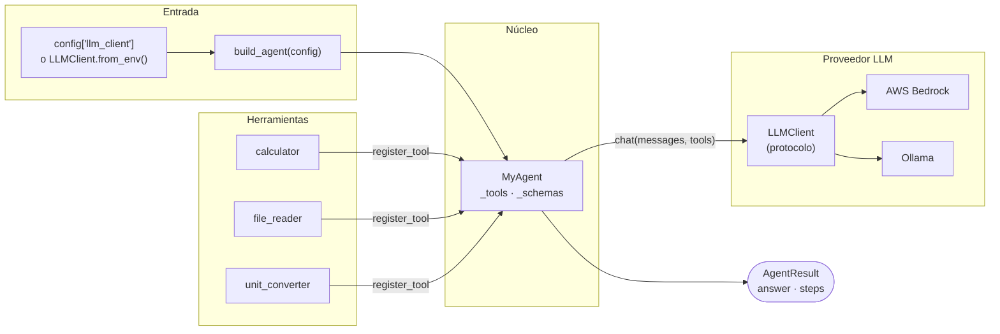
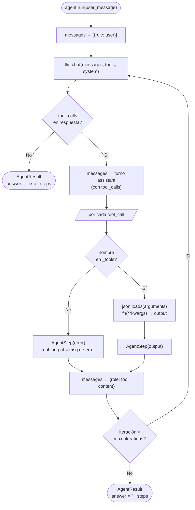

# Informe M1 — Bucle del agente y herramientas

## 1. Diagrama de arquitectura

El sistema se organiza en cuatro capas que separan la configuración, el razonamiento, las herramientas y el acceso al proveedor LLM.

### 1.1 Componentes del sistema



| Capa | Responsabilidad |
|---|---|
| `build_agent` | Única puerta de entrada pública; inyecta el cliente LLM y registra las herramientas |
| `MyAgent` | Mantiene el registro de herramientas y ejecuta el bucle |
| `LLMClient` | Abstrae el proveedor (Bedrock / Ollama); traduce `ToolSchema` al formato del proveedor |
| Tools (`tools/`) | Callables puros sin estado; retornan siempre `str` |

### 1.2 Bucle del agente

Dentro de `MyAgent`, el control de flujo sigue este ciclo hasta que el LLM produce texto sin herramientas o se agota el límite de iteraciones:



---

## 2. Diseño de la interfaz de herramientas

La interfaz de herramientas sigue tres pasos: definir la firma Python con metadatos, derivar el esquema automáticamente, y registrar callable y esquema por separado para que el agente pueda despachar y exponer cada herramienta sin mezclar esas responsabilidades.

### 2.1 Definición: `ToolSchema.from_callable`

El esquema JSON que el LLM necesita para invocar una herramienta se deriva automáticamente de la firma Python usando `Annotated` y `Field`:

```python
def calculator(
    left_operand:  Annotated[float, Field(description="Operando izquierdo.")],
    operator:      Annotated[str,   Field(description="Operador: +, -, *, %.")],
    right_operand: Annotated[float, Field(description="Operando derecho.")],
) -> str: ...

calculator_schema = ToolSchema.from_callable(calculator)
```

`from_callable` extrae:
- **`name`** — nombre de la función Python
- **`description`** — primer párrafo del docstring
- **`parameters`** — JSON Schema generado a partir de los tipos y `Field(description=...)` de cada parámetro

No se escribe JSON Schema a mano; si se agrega un parámetro, el esquema se actualiza solo.

### 2.2 Registro: `register_tool`

```python
def register_tool(self, tool: Callable[..., str], schema: ToolSchema) -> None:
    self._tools[schema.name]   = tool    # para el despacho en run()
    self._schemas[schema.name] = schema  # para exponerlo al LLM
```

Se mantienen dos diccionarios separados indexados por `schema.name`. `_tools` guarda el callable real que se ejecuta; `_schemas` guarda la descripción que se envía al LLM. La separación permite iterar sobre esquemas sin mezclar esa responsabilidad con el despacho.

### 2.3 Exposición al LLM: `chat(tools=...)`

En cada iteración del bucle, el agente pasa la lista completa de esquemas al cliente:

```python
resp = self._llm.chat(
    messages=messages,
    tools=list(self._schemas.values()),
    system=self._system,
)
```

El `LLMClient` llama a `schema.to_llm_spec()` por cada `ToolSchema` y formatea la lista al contrato del proveedor (Bedrock o Ollama). El agente nunca conoce ese formato.

### 2.4 Despacho: `json.loads` + `**kwargs`

Cuando el LLM decide invocar una herramienta devuelve un `ToolCall` donde `arguments` es siempre una cadena JSON:

```
ToolCall(id="c1", name="calculator", arguments='{"left_operand": 17, "operator": "*", "right_operand": 23}')
```

El agente deserializa y despacha en dos líneas:

```python
kwargs = json.loads(tool_call.arguments)   # str → dict
output = self._tools[tool_call.name](**kwargs)
```

Pasar `arguments` directamente como string haría que el callable recibiera un argumento incorrecto; el `json.loads` es obligatorio.

---

## 3. Terminación del bucle

El bucle tiene dos condiciones de salida. La condición normal es que el LLM devuelva texto; la de seguridad es que se alcance el límite de iteraciones.

### 3.1 Condición normal: respuesta de texto sin `tool_calls`

```python
if not resp.tool_calls:
    return AgentResult(answer=resp.content or "", steps=steps,
                       input_tokens=total_input, output_tokens=total_output)
```

Cuando el LLM devuelve texto sin solicitar ninguna herramienta, el agente considera que el razonamiento está completo y ese texto se convierte directamente en `AgentResult.answer`. Los tokens acumulados a lo largo de todas las iteraciones se incluyen en el resultado.

La herramienta sintética `final_result` no forma parte de este diseño; el bucle termina naturalmente cuando el LLM produce texto libre.

### 3.2 Condición de seguridad: `max_iterations`

```python
for _ in range(self._max_iterations):
    ...

return AgentResult(answer="", steps=steps, input_tokens=total_input, output_tokens=total_output)
```

Si se llega al límite sin que el LLM produzca texto, el bucle termina devolviendo un `AgentResult` con `answer=""` y los pasos y tokens acumulados hasta ese momento. Nunca se lanza una excepción. El valor por defecto es `max_iterations=10`, ajustable como parámetro del constructor.

### 3.3 Herramienta desconocida

Si el LLM alucina un nombre de herramienta que no existe, el agente no interrumpe el bucle; registra el error y lo devuelve al LLM para que pueda corregir su próxima respuesta:

```python
if tool_call.name not in self._tools:
    steps.append(AgentStep(
        tool_name=tool_call.name,
        tool_input=tool_call.arguments,
        tool_output=None,
        error=f"Herramienta desconocida: {tool_call.name}",
    ))
    tool_output = f"Error: herramienta desconocida '{tool_call.name}'"
```

---

## 4. Herramienta de elección libre: `unit_converter`

La tercera herramienta convierte valores numéricos entre unidades de la misma categoría física: longitud, masa, tiempo y temperatura.

### 4.1 Motivación y criterios de selección

Se eligió un conversor de unidades porque:

- Cubre un caso de uso real y verificable (el LLM puede comparar el resultado con su propio conocimiento).
- Requiere manejo explícito de categorías incompatibles (km → kg debe rechazarse), lo que ejercita la lógica de validación y el retorno de errores como `str`.
- La temperatura introduce una conversión **no lineal** (Celsius/Fahrenheit/Kelvin), que demuestra que la herramienta puede contener lógica de dominio no trivial.

### 4.2 Diseño: unidad canónica

En lugar de mantener una matriz N×N de pares de conversión, cada unidad almacena dos factores respecto a una unidad **canónica** de su categoría:

| Categoría | Canónico | Ejemplo de entrada |
|---|---|---|
| Longitud | metro (`m`) | `km` → × 1 000 → `m` |
| Masa | kilogramo (`kg`) | `lb` → × 0.453592 → `kg` |
| Tiempo | segundo (`s`) | `h` → × 3 600 → `s` |
| Temperatura | Celsius (`C`) | conversión no lineal, ver §4.3 |

La conversión de cualquier unidad A a cualquier unidad B se hace en dos pasos:

```
valor_A × factor(A→canónico) × factor(canónico→B)
```

Esto reduce la complejidad de O(N²) pares a O(N) entradas. Agregar una unidad nueva es una línea en el diccionario correspondiente; la lógica de despacho no cambia.

### 4.3 Temperatura: conversión no lineal

Las conversiones entre Celsius, Fahrenheit y Kelvin no son multiplicaciones simples. La función `_convertir_temperatura` las maneja en dos pasos explícitos:

```python
# Paso 1: valor de origen → Celsius (canónico de temperatura)
if origen == "F":
    celsius = (valor - 32) * 5 / 9
elif origen == "K":
    celsius = valor - 273.15
else:
    celsius = valor   # ya está en Celsius

# Paso 2: Celsius → destino
if destino == "F":
    return celsius * 9 / 5 + 32
if destino == "K":
    return celsius + 273.15
return celsius
```

La temperatura se trata por separado antes de ingresar a la tabla lineal, lo que mantiene ambos caminos limpios y sin condiciones mezcladas.

### 4.4 Validación de categoría por identidad de objeto

La herramienta detecta mezclas de categoría (ej: `km` → `kg`) comparando la identidad del diccionario al que pertenece cada unidad:

```python
_TABLA: dict[str, dict] = {u: d for d in (_LONGITUD, _MASA, _TIEMPO) for u in d}

if _TABLA[from_unit] is not _TABLA[to_unit]:
    return "Error: categorías distintas — no se puede convertir entre ellas."
```

`_LONGITUD`, `_MASA` y `_TIEMPO` son objetos distintos en memoria. Si `from_unit` y `to_unit` apuntan al mismo objeto `is` devuelve `True`; si apuntan a objetos distintos, son categorías incompatibles. No se compara por nombre de cadena ni por enum, lo que elimina la posibilidad de falsos positivos por typos o aliasing.

### 4.5 Contratos de la herramienta

| Condición | Retorno |
|---|---|
| Conversión válida | `str(round(resultado, 6))` |
| Unidad no reconocida | `"Error: unidad '...' no reconocida. Unidades válidas: ..."` |
| Categorías distintas | `"Error: '...' y '...' pertenecen a categorías distintas — ..."` |
| Temperatura mezclada con lineal | `"Error: '...' no es una unidad de temperatura. ..."` |

Todos los errores se retornan como `str`, nunca como excepciones, para que el agente pueda incluirlos en el historial de mensajes y el LLM pueda corregir su próxima llamada.

---

## 5. Limitaciones conocidas

### Sin memoria entre llamadas a `run`

Cada invocación de `run` construye una lista `messages` nueva. Las llamadas sucesivas sobre la misma instancia no comparten contexto. Este comportamiento es intencional en el diseño actual.

### `max_history_messages` ignorado

El parámetro se acepta en el constructor pero no se aplica. La lista `messages` crece sin límite dentro de una sola llamada a `run`.

### Herramientas ejecutadas de forma secuencial

Cuando el LLM emite múltiples `tool_calls` en un mismo turno, el agente los ejecuta uno a uno. No hay paralelismo.

### `file_reader` restringido a `data/`

Por diseño, el lector de archivos solo puede acceder al directorio `data/` del proyecto. Rutas con `..`, rutas absolutas fuera de ese directorio y variantes con symlinks son rechazadas. Sin esta restricción, el LLM podría ser manipulado para leer archivos arbitrarios del sistema.

### `calculator` limitado a cuatro operadores

Solo se soportan `+`, `-`, `*`, `%`. División (`/`) no está incluida para evitar implementar manejo de división entera vs. flotante. Potenciación y otras operaciones quedan fuera del alcance.
