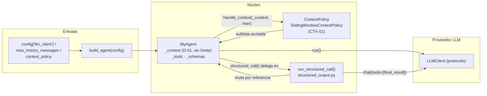
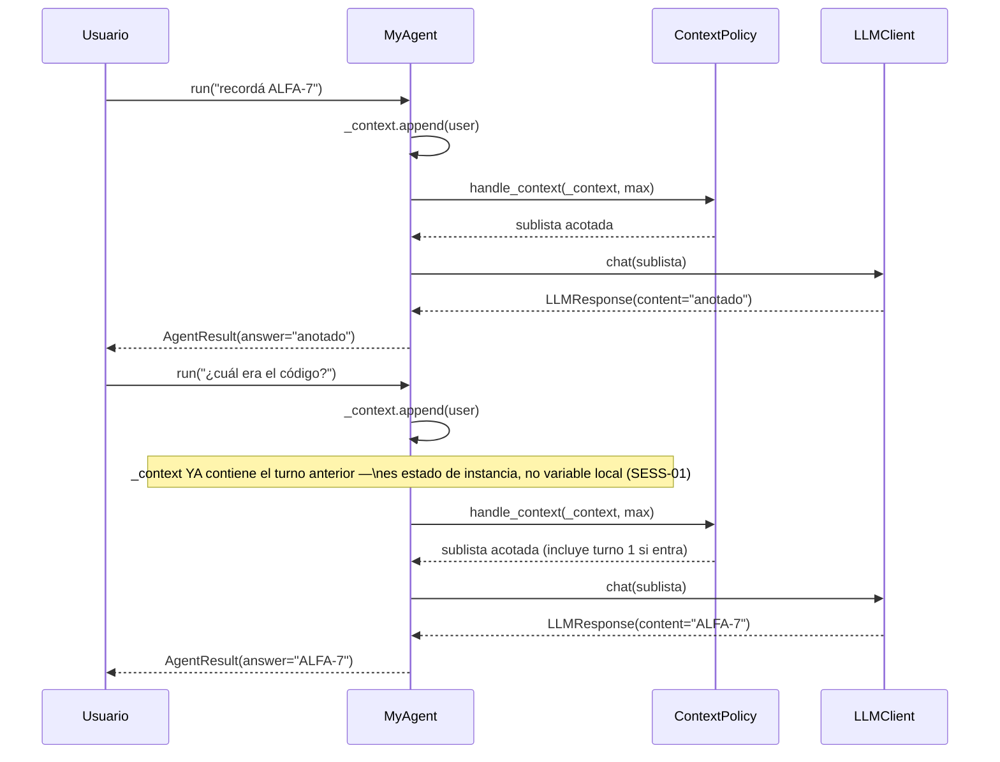
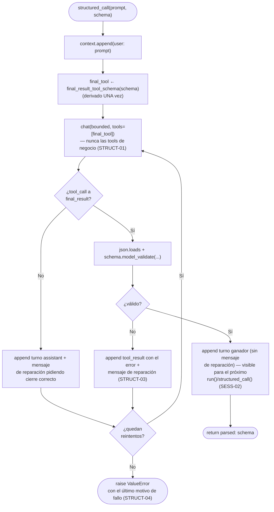

# Informe M2 — Conversación estatal y salida estructurada

## 1. Diagrama de arquitectura

M2 agrega dos capas nuevas sobre el núcleo de M1: una **política de acotado de contexto** que decide qué sublista de la memoria completa se envía en cada `chat()`, y un **módulo de salida estructurada** que aísla el mecanismo de reparación de `structured_call` como una función libre, separada de `MyAgent.run`.

### 1.1 Componentes del sistema



| Capa | Responsabilidad |
|---|---|
| `MyAgent._context` | Memoria completa de la sesión, nunca truncada (D-01) — única fuente de verdad para `run()` y `structured_call()` |
| `ContextPolicy` | Decide qué sublista de `_context` viaja en cada `chat()`; intercambiable vía `build_agent({"context_policy": ...})` (D-05) |
| `structured_output.run_structured_call` | Función libre (no método) que implementa el loop de reparación de `structured_call`, recibiendo `context` por referencia |
| `LLMClient` | Sin cambios respecto a M1: sigue traduciendo `ToolSchema` al formato del proveedor |

### 1.2 Statefulness: dos llamadas a `run()` sobre la misma instancia



`self._context` vive en `__init__` como lista de instancia (`agent.py:76`), no como variable local de `run()`. Cada llamada hace `self._context.append(...)` sobre la misma lista — es la diferencia mínima que separa un agente estatal de uno que reconstruye `messages = []` en cada invocación.

---

## 2. Gestión de contexto: `ContextPolicy` (CTX-01)

### 2.1 Motivación: separar memoria completa de memoria enviada

`self._context` nunca se recorta — guardar todo es necesario porque `structured_call` y `run` deben poder verse mutuamente el historial completo (SESS-02, ver §4). Lo que sí tiene un tope es la sublista que efectivamente viaja al proveedor en cada `chat()`. Esa decisión se aísla en una clase separada, `ContextPolicy`, en vez de resolverla inline en `run()`:

```python
class ContextPolicy(ABC):
    @abstractmethod
    def handle_context(self, context: list[dict], max_messages: int) -> list[dict]:
        ...

    def on_evict(self, evicted: list[dict]) -> None:
        """Hook opcional: se llama con los mensajes descartados, para
        estrategias que quieran loguearlos o resumirlos más adelante."""
```

Es una `ABC` y no un `typing.Protocol` porque comparte comportamiento concreto (`on_evict` con implementación por defecto) — el mismo criterio que ya separa `_BaseLLMProvider` de un protocolo puro en `mia_agents/llm_client.py`. Esta separación permite intercambiar la estrategia de memoria (`build_agent({"context_policy": ...})`, D-05) sin tocar `MyAgent.run`.

### 2.2 `SlidingWindowContextPolicy`: ventana por cantidad de mensajes, no por tokens

El corte es por **cantidad de mensajes** (`len(context)`), no por tokens — así lo fija `test_bounded_history_growth`, que mide `len(call["messages"])`. Ventanear por tokens sería una extensión válida pero no es lo que el contrato de conformidad pide (ver tabla de alcance, §6).

### 2.3 `atomic_turns`: no partir un turno de herramientas a la mitad

```python
if self._atomic_turns:
    bounded, evicted = self._atomic_trim(context, max_messages)
else:
    cutoff = len(context) - max_messages
    evicted, bounded = context[:cutoff], context[cutoff:]
```

Con `atomic_turns=True` (default), el recorte nunca separa un mensaje `assistant` con `tool_calls` de sus respuestas `role: tool` correspondientes. `_segment_into_units` agrupa el historial en unidades atómicas antes de recortar, y `_atomic_trim` conserva el sufijo más reciente de unidades completas que entra en el presupuesto — nunca una unidad partida a la mitad.

La razón: enviarle al proveedor un `tool_call` sin su `tool_result` (o viceversa) no es solo una pérdida de contexto — varias APIs de proveedor (incluida la Converse API real de Bedrock) rechazan ese payload directamente. Cortar por cantidad cruda de mensajes sin este cuidado produciría un historial sintácticamente inválido, no solo incompleto.

### 2.4 Caso límite D-04: ni el turno más reciente entra en el tope

```python
if not kept_units:
    # CTX-01 manda: se prioriza el corte estricto sobre el pairing, solo esta llamada.
    cutoff = max(len(context) - max_messages, 0)
    bounded = context[cutoff:]
    while bounded and bounded[0].get("role") == "tool":
        bounded = bounded[1:]
    evicted = context[: len(context) - len(bounded)]
    return bounded, evicted
```

Si `max_history_messages` es tan chico que ni la unidad atómica más reciente entra completa, el respeto estricto del tope (CTX-01) pesa más que el pairing (que es una garantía de mejor esfuerzo, no absoluta). En ese caso se hace un corte crudo y, además, se descarta cualquier `role: tool` huérfano que haya quedado al principio de la ventana — un resultado de herramienta sin su `tool_call` en la misma ventana es un payload inválido igual que en el caso general.

---

## 3. Salida estructurada garantizada: `structured_call` (STRUCT-01..04)

### 3.1 Por qué es una función libre y no un método de `MyAgent`

```python
def run_structured_call(
    llm: LLMClient,
    context: list[dict],
    context_policy: ContextPolicy,
    max_history_messages: int,
    system_prompt: str,
    prompt: str,
    schema: Any,
    max_repair_attempts: int = 2,
) -> Any: ...
```

Las dependencias (cliente LLM, historial compartido, política de contexto) quedan explícitas en la firma en vez de implícitas en `self`. Esto la hace testeable sin construir un `MyAgent` completo, y separa visiblemente dos condiciones de parada que conviene no mezclar en una misma clase larga: texto libre (M1/`run`) vs. `final_result` validado (M2/`structured_call`).

`MyAgent.structured_call` queda como un adaptador delgado que solo pasa `self._context` y `self._context_policy` por referencia:

```python
def structured_call(self, prompt: str, schema: Any, max_repair_attempts: int = 2) -> Any:
    return run_structured_call(
        llm=self._llm, context=self._context, context_policy=self._context_policy,
        max_history_messages=self._max_history_messages, system_prompt=self._system,
        prompt=prompt, schema=schema, max_repair_attempts=max_repair_attempts,
    )
```

### 3.2 Bucle de reparación



### 3.3 Contratos verificados por `test_m2.py`

| Requisito | Mecanismo | Test |
|---|---|---|
| STRUCT-01 — solo `final_result` disponible | `tools=[final_tool]` en cada `chat()` del método, nunca `self._schemas` | `test_structured_call_offers_final_result_tool` |
| STRUCT-02 — cierre solo con validación exitosa | `schema.model_validate(json.loads(args))` antes de retornar | `test_structured_output_repairs_schema_validation_error` |
| STRUCT-03 — reparación con contexto del fallo | mensaje `role: tool` con el error + mensaje `role: user` pidiendo corrección | `test_structured_output_repairs_schema_validation_error` |
| STRUCT-04 — nunca `None` ni instancia parcial | `raise ValueError(...)` tras agotar `max_repair_attempts` | `test_structured_output_max_retries` |

`max_repair_attempts` cuenta **reparaciones**, no intentos totales — a diferencia de `MAX_TOOL_ATTEMPTS` de `run()` (que cuenta intentos totales). El rango de iteración es `max_repair_attempts + 1`: 1 llamada inicial + N reparaciones. Con `max_repair_attempts=2` esto da exactamente 3 llamadas a `chat()`, que es lo que `test_structured_output_max_retries` verifica contando `mock.call_count`.

---

## 4. `run()` y `structured_call()` comparten un único historial (SESS-02)

```python
# run_structured_call recibe `context` por referencia y lo muta con
# `.append(...)` — no lo copia ni lo retorna — porque es el MISMO
# `self._context` que usa `run()`.
context.append({"role": "user", "content": prompt})
```

`structured_output.py` no recibe una copia del historial: recibe la misma lista (`self._context`) que `MyAgent.run` muta. Esto significa que:

- Un `run()` seguido de un `structured_call()` sobre la misma instancia ve el turno anterior (`test_structured_call_shares_context_with_run`).
- Dos `structured_call()` sucesivos también son estatales entre sí (`test_structured_call_is_stateful_across_calls`).

La alternativa — que `structured_call` mantuviera su propio historial local — hubiera obligado a `MyAgent` a sincronizar dos listas de mensajes (o a elegir cuál de las dos es la fuente de verdad). Pasar la misma referencia elimina esa sincronización por construcción: hay un solo lugar donde vive la conversación.

---

## 5. Manejo robusto de errores de herramientas (ERR-01..04)

M2 extiende el despacho de tools de M1 con reintentos, backoff y un mensaje legible cuando una tool falla — sin que eso rompa el loop de `run()`.

### 5.1 Fallo determinístico vs. fallo transitorio

```python
try:
    kwargs = json.loads(tool_call.arguments)
    if not isinstance(kwargs, dict):
        raise TypeError(f"se esperaba un objeto JSON, se recibió {type(kwargs).__name__}")
except Exception as exc:
    error_msg = f"Argumentos inválidos para '{tool_call.name}': {type(exc).__name__}: {exc}"
```

Un JSON inválido o con forma no-mapping falla igual en cada intento — reintentarlo no cambia el resultado. Por eso ese caso se falla rápido, sin retry, y solo el fallo de la *ejecución* de la tool (que puede ser transitorio — una API externa caída, un timeout) entra al loop de reintentos con backoff:

```python
for attempt in range(MAX_TOOL_ATTEMPTS):  # 1 intento inicial + 2 reintentos (ERR-01)
    try:
        tool_output = self._tools[tool_call.name](**kwargs)
        error_msg = None
        break
    except Exception as exc:
        error_msg = f"La herramienta '{tool_call.name}' falló tras {attempt + 1} intento(s): {type(exc).__name__}: {exc}"
        if attempt < MAX_TOOL_ATTEMPTS - 1:
            time.sleep(RETRY_BACKOFF_BASE * (2 ** attempt))
```

`MAX_TOOL_ATTEMPTS = 3` está fijado como constante de módulo, no como parámetro de `MyAgent` o `build_agent`: el enunciado lo deja explícitamente fuera de alcance como configurable (ver tabla de alcance, §6), y el valor espeja `max_repair_attempts=2` de `structured_call` (1 + 2) para mantener consistencia entre los dos mecanismos de reintento del agente.

### 5.2 El fallo nunca aborta el loop, y nunca se silencia

- **ERR-02**: agotados los reintentos, el error queda como observación `role: tool` en el historial — el LLM lo ve y puede reaccionar (reintentar con otros argumentos, informar al usuario) en el próximo turno.
- **ERR-03**: el mensaje usa `type(exc).__name__: {exc}`, nunca `traceback.format_exc()` — no se expone al modelo ni al usuario final la ruta interna ni la traza de Python.
- **ERR-04**: el error queda registrado en dos lugares simultáneamente — `AgentStep.error` (para quien inspeccione `AgentResult.steps` programáticamente) y el mensaje `role: tool` (para que el propio LLM lo vea) — nunca se pierde silenciosamente.

---

## 6. Alcance: qué quedó deliberadamente afuera

| Decisión | Razón |
|---|---|
| Estrategias de memoria alternativas (resumen, recuperación semántica) | Sliding window es la estrategia obligatoria; otras son válidas pero no reemplazan el requisito |
| Sliding window por tokens en vez de por cantidad de mensajes | `test_bounded_history_growth` fija el contrato por `len(messages)` |
| `max_tool_retries` configurable | Valor fijo (2 reintentos) para mantener consistencia con `max_repair_attempts=2` de `structured_call` |
| `final_result` disponible dentro de `run()` | Rompería los contratos de test de M1 y M2 — `final_result` es exclusivo de `structured_call` |

---

## 7. Limitaciones conocidas

### `structured_call` no expone tokens

A diferencia de `run()`, `structured_call` devuelve directamente la instancia validada del schema Pydantic (contrato fijo en `mia_agents/protocols.py`), no un `AgentResult`. `run_structured_call` tampoco acumula tokens internamente, así que no hay `input_tokens`/`output_tokens` que reportar para esa llamada — solo los turnos de `run()` en la misma sesión los exponen.

### Herramientas ejecutadas de forma secuencial (heredado de M1)

Cuando el LLM emite múltiples `tool_calls` en un mismo turno, el agente los sigue ejecutando uno a uno, incluyendo sus reintentos con backoff — no hay paralelismo. Con `MAX_TOOL_ATTEMPTS=3` y backoff exponencial, una tool que falla sistemáticamente puede introducir latencia notable antes de que el turno complete.

### Backoff fijo, no configurable

`RETRY_BACKOFF_BASE = 0.1` es una constante de módulo pensada para que los tests corran rápido sin necesidad de `monkeypatch` sobre `time.sleep`. Un despliegue real contra un proveedor con rate limiting agresivo probablemente necesite una base mayor o jitter, ninguno de los cuales está implementado.
